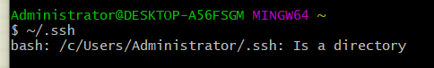
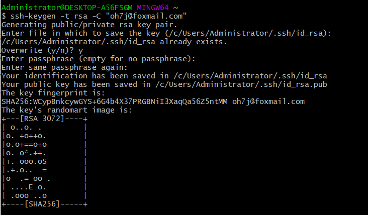
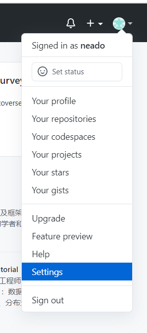
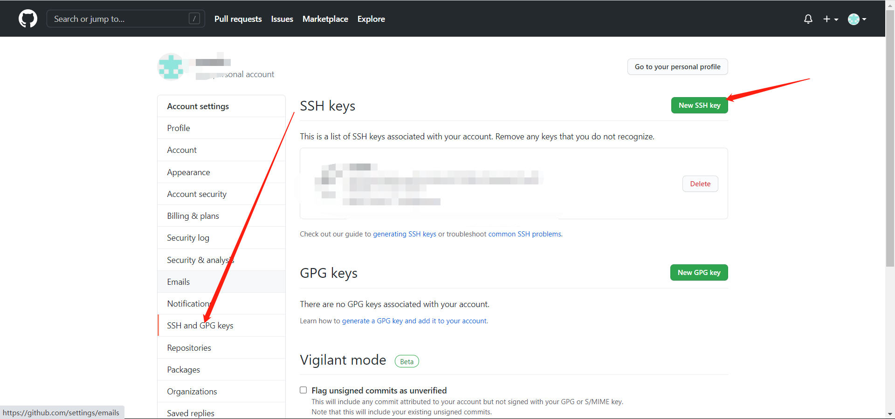
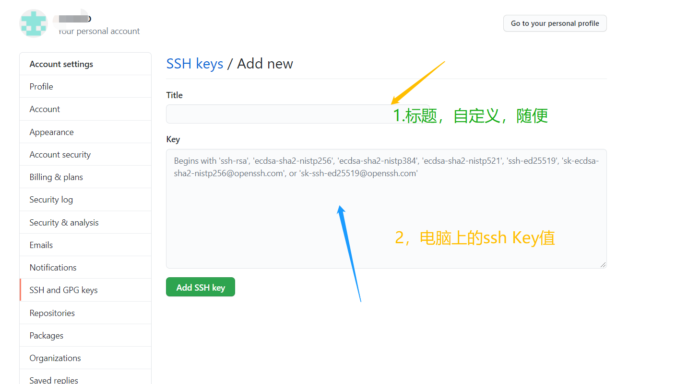

# GitHub学习使用


## 0.检查电脑上是否已经创建SSH KEY

```
~/.ssh
#或者
~/.ssh ls
```

作用:查找电脑存储介质（硬盘上是否有ssh这个文件夹）


结果：

- **有**

  > bash: /c/Users/Administrator/.ssh: Is a directory

- **无**

  > bash: /c/Users/Administrator/.ssh: **No such file or directory**




## 1.创建SSH-KEY

若已存在就不用

```
ssh-keygen -t rsa -C "fh6c@foxmail.com"
```





**Generating public/private rsa key pair.
Enter file in which to save the key (/c/Users/Administrator/.ssh/id_rsa):**

> 用处：输入文件名，保存ssh文件，可自定义。一般不写就默认创建 id_rsa和id_rsa.pub


**Created directory ‘/c/Users/Administrator/.ssh’.**

> 创建好.ssh这个文件夹


**Enter passphrase (empty for no passphrase):**

> 输入设置密码，若设置ssh使用时即要输入密码。
>
> 一般为默认

**Enter same passphrase again:**

> 再次输入，确保密码被你记住


**回车显示**

```
Your identification has been saved in /c/Users/Administrator/.ssh/id_rsa
Your public key has been saved in /c/Users/Administrator/.ssh/id_rsa.pub
The key fingerprint is:

```


验证ssh是否创建成功

```
~/.ssh
```

具体看第一个

## 2.添加ssh-KEY 到GitHub

### 用户名下，选Settings





### 选 SSH and GPG keys




### 点new SSH KEY





## SSH Key值若到文件里面复制会报错

# Key is invalid. You must supply a key in OpenSSH public key format github


原因：直接复制粘贴会破坏格式

GitBash输入

```
clip < ~/.ssh/id_rsa.pub
```

回车后剪切板就会有了


粘贴到那里就是

**然后 Add SSH key**


## 3.测试SSH Key连接GitHub


```
$ ssh -T git@github.com
```

 git@github.com为发送信息给github确认

正确会返回信息，并显示用户名


```
$ ssh -T git@github.com
The authenticity of host 'github.com (13.229.188.59)' can't be established.
RSA key fingerprint is SHA256:nThbg6kXUpJWGl7E1IGOCspRomTxdCARLviKw6E5SY8.
Are you sure you want to continue connecting (yes/no/[fingerprint])? yes
Warning: Permanently added 'github.com,13.229.188.59' (RSA) to the list of known hosts.
Hi neado! You've successfully authenticated, but GitHub does not provide shell access.

```


# 使用GitHub


## 1.先选个项目文件夹

右键Git Bash

```git
$ git init
```

使用这个命令会在这个目录里面生成   ” .git “ 的隐藏文件夹,

> ### **里面存放着暂存区，历史区等等信息，删了就不是完整的git仓库了**


## git目录作用


Git跟踪管理版本库


## 添加到暂存区

**某一文件或文件夹**

```
git add 
```

**当前仓库（就是那个文件夹）里面的所有东西提交到暂存区**

```
git add .
```


**暂存区提交到git仓库**

```
#git push origin master
```


**把本地仓库的内容推送到GitHub仓库。**

```
git remote add origin git@github.com:neado/testRepository.git
```

> github帐号名）/gitdemo（项目名）.git 

